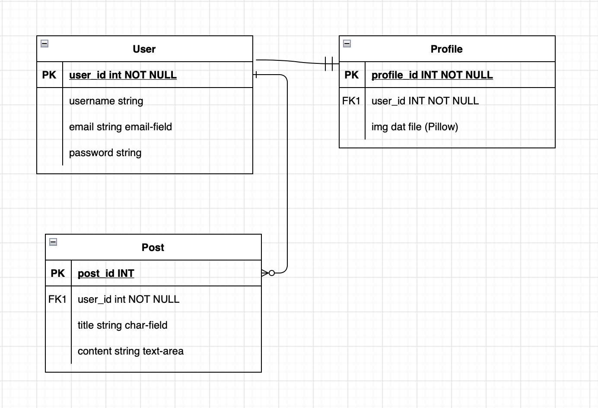
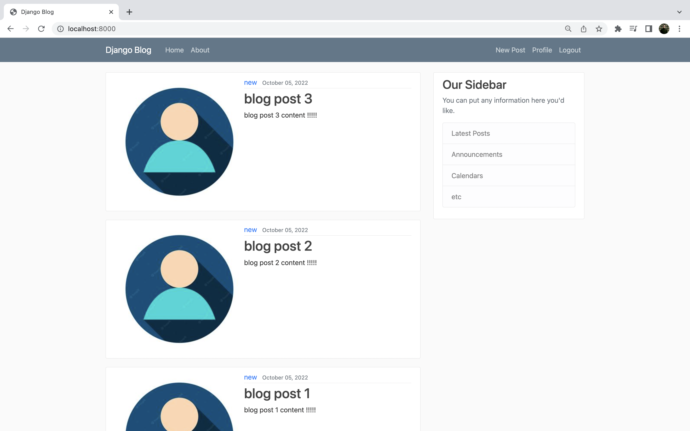
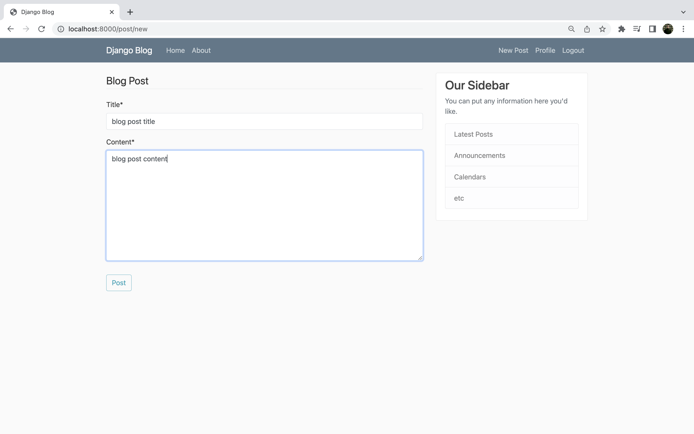
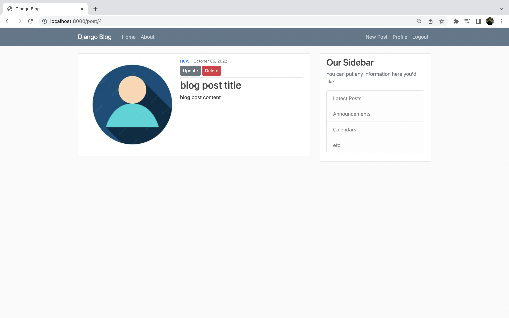
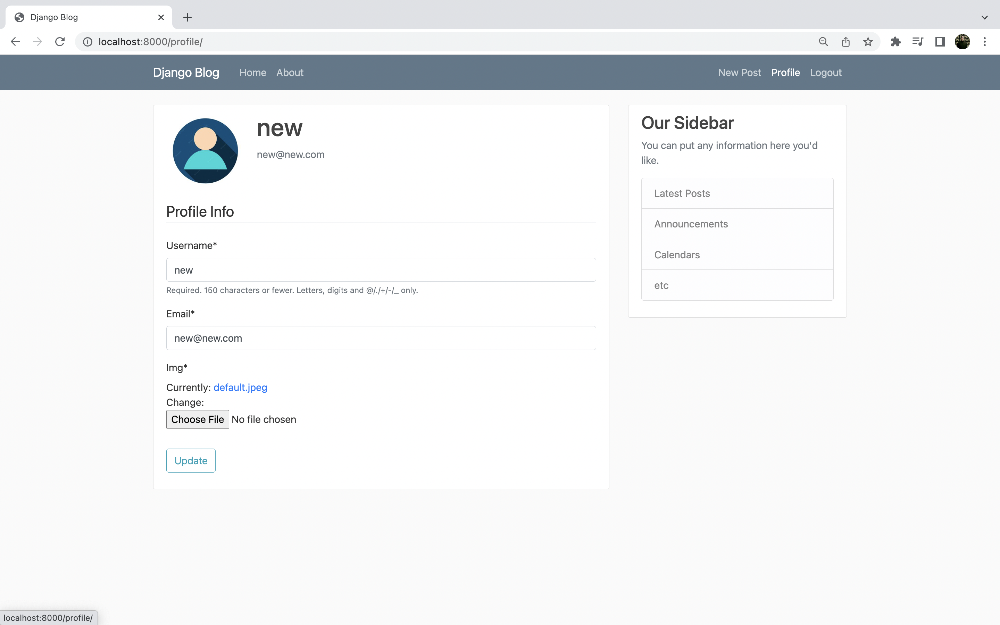

# Django-Blog
Full featured blog with pagination and password reset email.
## Entity Relationship Diagram:
      
***    
## Overview:
        
    - The home page features the recent blog posts by any users whether logged in or not.

        
    - Django Crisy Forms use Bootstrap 4 and some validation to create nice forms for POST requests.

        
    - After posting the user is directed to view their post and if the user viewing the post detail page is the user that posted that particular post, they will have the option to update or delete that post. 
    - The Update Button takes the user back to the post form with the specified post data prefilled in for a PUT request to update.
    - The Delete Button will prompt the user with a dialog modal to confirm or deny the DELETE request. Once confirmed the post will the be removed from the database.
    
    
    - The user profile page allows the user to update their user info, email, username, profile image.
    - To reset password user must be logged out then they may click the reset password button which will send an email to confirm and update password reset.
    - The users profile image is defaulted to the uniperson icon if none is chosen for the account.    

***       
### Tech Used:
* Python
* Django
* Bootstrap 4
* Django-Crispy-Forms
* Pillow (img handling)
***       
### Links:
[LinkedIn](https://www.linkedin.com/in/markharmon142/)       
[Twitter](https://twitter.com/ManicNeo142)        